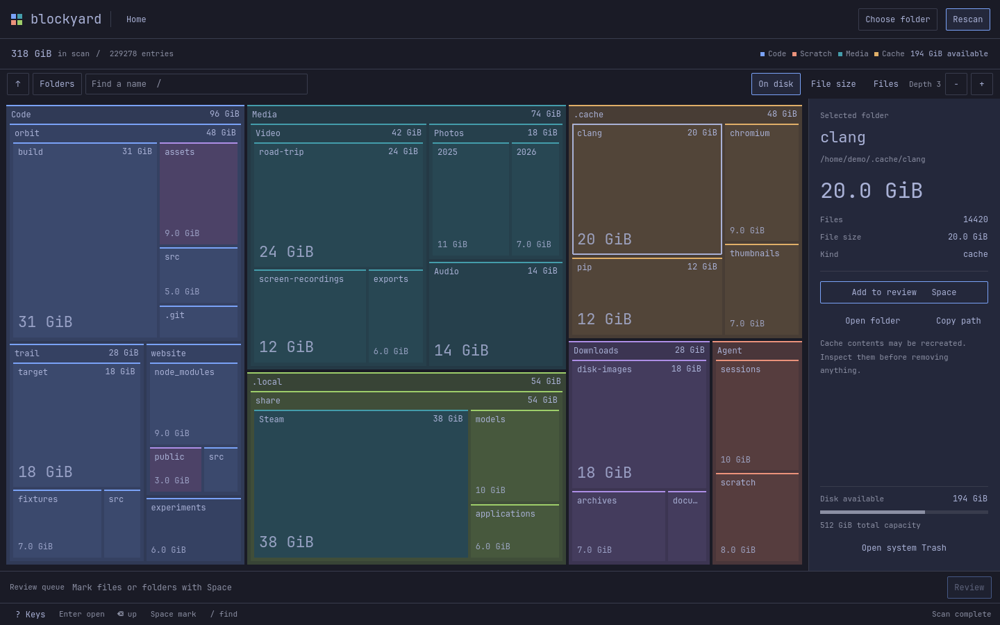
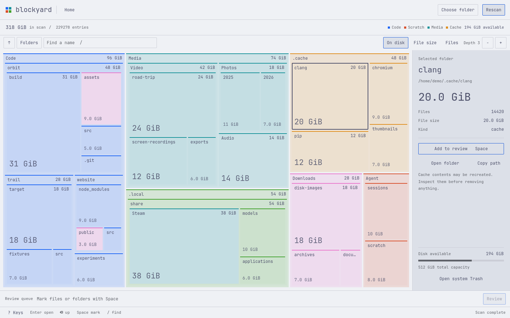
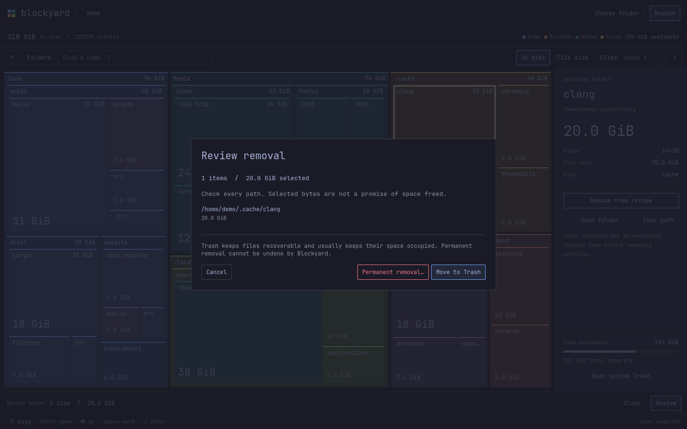

<div align="center">


# Blockyard

**See what's taking up space.**

A visual disk explorer for Omarchy. Find the big folders, inspect what's inside, and review what to remove.

[Download for Omarchy](https://github.com/allisonmahmood/blockyard/releases/latest) · [Documentation](docs/usage.md) · [Report a bug](https://github.com/allisonmahmood/blockyard/issues)

</div>



*Tokyo Night. Screenshots use illustrative demo data.*

## Find the folders that matter

- See space as nested blocks. Bigger folders take up more of the map.
- Double-click to explore, or use the folder list and search to find a name.
- Compare space on disk, file sizes and file counts, including hidden files.
- Mark items for review, check their paths, then choose Trash or permanent removal.

## Matches your Omarchy theme

Change your theme in Omarchy and Blockyard updates while it's open. Colors and fonts follow your desktop, including light themes.



*Catppuccin Latte. Same app, same demo folders.*

## Review before removing

Blockyard shows the selected paths before acting. Trash keeps files recoverable; permanent removal has a separate confirmation. Nothing is selected for cleanup automatically.

<details>
<summary>See the cleanup review</summary>



</details>

Trash usually retains disk space until emptied. Selected bytes can also differ from space freed because of snapshots or shared data. [Read how cleanup works](docs/engine.md).

## Install

Download the x86_64 package and `SHA256SUMS` from the [latest release](https://github.com/allisonmahmood/blockyard/releases/latest). On an up-to-date Omarchy or Arch installation:

```sh
sha256sum --ignore-missing --check SHA256SUMS
sudo pacman -U ./blockyard-0.1.0-1-x86_64.pkg.tar.zst
```

Open **Blockyard** from your application launcher, or run `blockyard`.

Packages are currently unsigned. The release notes include verification details and source builds. AUR publication is planned when an account is available.

## More

[Build from source](docs/development.md) · [Keyboard controls](docs/usage.md#navigation) · [How cleanup works](docs/engine.md) · [Theme support](docs/theming.md) · [Report an issue](https://github.com/allisonmahmood/blockyard/issues)

Contributions and bug reports are welcome. [MIT licensed](LICENSE).
